%NNPDF report comparing 230129-ab-baseline-nlo-partialglobal and 230129-ab-baseline-nnlo-partialglobal

Summary
-------

We are comparing:

  - Current Fit (`230129-ab-baseline-nlo-partialglobal`): NNPDF4.0 methodology fit baseline for theory covariance matrix, NLO, GLOBAL (PARTIAL)
  - Reference Fit (`230129-ab-baseline-nnlo-partialglobal`): NNPDF4.0 methodology fit baseline for theory covariance matrix, NNLO, GLOBAL (PARTIAL)

<table class="dataframe">
<thead>
<tr style="text-align: right;">
<th></th>
<th>Current Fit</th>
<th>Reference Fit</th>
</tr>
</thead>
<tbody>
<tr>
<th>$\chi^2$</th>
<td>1.23299</td>
<td>1.28765</td>
</tr>
<tr>
<th>$<E_{\mathrm{trn}}>$</th>
<td>2.277±0.071</td>
<td>2.300±0.081</td>
</tr>
<tr>
<th>$<E_{\mathrm{val}}>$</th>
<td>2.36±0.13</td>
<td>2.35±0.12</td>
</tr>
<tr>
<th>$<TL>$</th>
<td>9300±2700</td>
<td>9400±2300</td>
</tr>
<tr>
<th>$<\chi^2>$</th>
<td>1.261±0.017</td>
<td>1.313±0.015</td>
</tr>
<tr>
<th>$\phi$</th>
<td>0.1680±0.0051</td>
<td>0.1583±0.0048</td>
</tr>
</tbody>
</table>

t0 losses
---------
<table class="dataframe">
<thead>
<tr style="text-align: right;">
<th></th>
<th>Current Fit</th>
</tr>
</thead>
<tbody>
<tr>
<th>t0pdfset</th>
<td>210713-theory-001</td>
</tr>
<tr>
<th>$\chi^2_{t0}$</th>
<td>1.26832</td>
</tr>
<tr>
<th>$<\chi^2_{t0}>$</th>
<td>1.297±0.015</td>
</tr>
</tbody>
</table>
<table class="dataframe">
<thead>
<tr style="text-align: right;">
<th></th>
<th>Reference Fit</th>
</tr>
</thead>
<tbody>
<tr>
<th>t0pdfset</th>
<td>210715-n3fit-1000-001</td>
</tr>
<tr>
<th>$\chi^2_{t0}$</th>
<td>1.29647</td>
</tr>
<tr>
<th>$<\chi^2_{t0}>$</th>
<td>1.321±0.011</td>
</tr>
</tbody>
</table>

Theory covariance summary
-------------------------
<table class="dataframe">
<thead>
<tr style="text-align: right;">
<th></th>
<th>Current Fit</th>
<th>Reference Fit</th>
</tr>
</thead>
<tbody>
<tr>
<th>sampling</th>
<td>False</td>
<td>False</td>
</tr>
<tr>
<th>fitting</th>
<td>False</td>
<td>False</td>
</tr>
<tr>
<th>validphys statistical estimators</th>
<td>False</td>
<td>False</td>
</tr>
</tbody>
</table>

Dataset properties
------------------
<table class="dataframe">
<thead>
<tr style="text-align: right;">
<th></th>
<th>Training fraction</th>
<th>Weight</th>
<th>C-factors</th>
<th>Other fields</th>
</tr>
<tr>
<th>Dataset</th>
<th></th>
<th></th>
<th></th>
<th></th>
</tr>
</thead>
<tbody>
<tr>
<th>NMCPD_dw_ite</th>
<td>0.75</td>
<td>1</td>
<td>-</td>
<td>custom_group: unset</td>
</tr>
<tr>
<th>NMC</th>
<td>0.75</td>
<td>1</td>
<td>-</td>
<td>custom_group: unset</td>
</tr>
<tr>
<th>SLACP_dwsh</th>
<td>0.75</td>
<td>1</td>
<td>-</td>
<td>custom_group: unset</td>
</tr>
<tr>
<th>SLACD_dw_ite</th>
<td>0.75</td>
<td>1</td>
<td>-</td>
<td>custom_group: unset</td>
</tr>
<tr>
<th>BCDMSP_dwsh</th>
<td>0.75</td>
<td>1</td>
<td>-</td>
<td>custom_group: unset</td>
</tr>
<tr>
<th>BCDMSD_dw_ite</th>
<td>0.75</td>
<td>1</td>
<td>-</td>
<td>custom_group: unset</td>
</tr>
<tr>
<th>CHORUSNUPb_dw_ite</th>
<td>0.75</td>
<td>1</td>
<td>-</td>
<td>custom_group: unset</td>
</tr>
<tr>
<th>CHORUSNBPb_dw_ite</th>
<td>0.75</td>
<td>1</td>
<td>-</td>
<td>custom_group: unset</td>
</tr>
<tr>
<th>NTVNUDMNFe_dw_ite</th>
<td>0.75</td>
<td>1</td>
<td>-</td>
<td>custom_group: unset</td>
</tr>
<tr>
<th>NTVNBDMNFe_dw_ite</th>
<td>0.75</td>
<td>1</td>
<td>-</td>
<td>custom_group: unset</td>
</tr>
<tr>
<th>HERACOMBNCEM</th>
<td>0.75</td>
<td>1</td>
<td>-</td>
<td>custom_group: unset</td>
</tr>
<tr>
<th>HERACOMBNCEP460</th>
<td>0.75</td>
<td>1</td>
<td>-</td>
<td>custom_group: unset</td>
</tr>
<tr>
<th>HERACOMBNCEP575</th>
<td>0.75</td>
<td>1</td>
<td>-</td>
<td>custom_group: unset</td>
</tr>
<tr>
<th>HERACOMBNCEP820</th>
<td>0.75</td>
<td>1</td>
<td>-</td>
<td>custom_group: unset</td>
</tr>
<tr>
<th>HERACOMBNCEP920</th>
<td>0.75</td>
<td>1</td>
<td>-</td>
<td>custom_group: unset</td>
</tr>
<tr>
<th>HERACOMBCCEM</th>
<td>0.75</td>
<td>1</td>
<td>-</td>
<td>custom_group: unset</td>
</tr>
<tr>
<th>HERACOMBCCEP</th>
<td>0.75</td>
<td>1</td>
<td>-</td>
<td>custom_group: unset</td>
</tr>
<tr>
<th>HERACOMB_SIGMARED_C</th>
<td>0.75</td>
<td>1</td>
<td>-</td>
<td>custom_group: unset</td>
</tr>
<tr>
<th>HERACOMB_SIGMARED_B</th>
<td>0.75</td>
<td>1</td>
<td>-</td>
<td>custom_group: unset</td>
</tr>
<tr>
<th>DYE886R_dw_ite</th>
<td>0.75</td>
<td>1</td>
<td>-</td>
<td>custom_group: unset</td>
</tr>
<tr>
<th>DYE886P</th>
<td>0.75</td>
<td>1</td>
<td>-</td>
<td>custom_group: unset</td>
</tr>
<tr>
<th>DYE605_dw_ite</th>
<td>0.75</td>
<td>1</td>
<td>-</td>
<td>custom_group: unset</td>
</tr>
<tr>
<th>DYE906R_dw_ite</th>
<td>0.75</td>
<td>1</td>
<td>ACC</td>
<td>custom_group: unset</td>
</tr>
<tr>
<th>CDFZRAP_NEW</th>
<td>0.75</td>
<td>1</td>
<td>-</td>
<td>custom_group: unset</td>
</tr>
<tr>
<th>D0ZRAP_40</th>
<td>0.75</td>
<td>1</td>
<td>-</td>
<td>custom_group: unset</td>
</tr>
<tr>
<th>D0WMASY</th>
<td>0.75</td>
<td>1</td>
<td>-</td>
<td>custom_group: unset</td>
</tr>
<tr>
<th>ATLASWZRAP36PB</th>
<td>0.75</td>
<td>1</td>
<td>-</td>
<td>custom_group: unset</td>
</tr>
<tr>
<th>ATLASZHIGHMASS49FB</th>
<td>0.75</td>
<td>1</td>
<td>-</td>
<td>custom_group: unset</td>
</tr>
<tr>
<th>ATLASLOMASSDY11EXT</th>
<td>0.75</td>
<td>1</td>
<td>-</td>
<td>custom_group: unset</td>
</tr>
<tr>
<th>ATLASWZRAP11CC</th>
<td>0.75</td>
<td>1</td>
<td>-</td>
<td>custom_group: unset</td>
</tr>
<tr>
<th>ATLASWZRAP11CF</th>
<td>0.75</td>
<td>1</td>
<td>-</td>
<td>custom_group: unset</td>
</tr>
<tr>
<th>ATLASDY2D8TEV</th>
<td>0.75</td>
<td>1</td>
<td>-</td>
<td>custom_group: unset</td>
</tr>
<tr>
<th>ATLAS_DY_2D_8TEV_LOWMASS</th>
<td>0.75</td>
<td>1</td>
<td>-</td>
<td>custom_group: unset</td>
</tr>
<tr>
<th>ATLAS_WZ_TOT_13TEV</th>
<td>0.75</td>
<td>1</td>
<td>NRM</td>
<td>custom_group: unset</td>
</tr>
<tr>
<th>ATLAS_TTB_DIFF_8TEV_LJ_TRAPNORM</th>
<td>0.75</td>
<td>1</td>
<td>-</td>
<td>custom_group: unset</td>
</tr>
<tr>
<th>ATLAS_TTB_DIFF_8TEV_LJ_TTRAPNORM</th>
<td>0.75</td>
<td>1</td>
<td>-</td>
<td>custom_group: unset</td>
</tr>
<tr>
<th>ATLAS_SINGLETOP_TCH_R_7TEV</th>
<td>0.75</td>
<td>1</td>
<td>-</td>
<td>custom_group: unset</td>
</tr>
<tr>
<th>ATLAS_SINGLETOP_TCH_R_13TEV</th>
<td>0.75</td>
<td>1</td>
<td>-</td>
<td>custom_group: unset</td>
</tr>
<tr>
<th>ATLAS_SINGLETOP_TCH_DIFF_7TEV_T_RAP_NORM</th>
<td>0.75</td>
<td>1</td>
<td>-</td>
<td>custom_group: unset</td>
</tr>
<tr>
<th>ATLAS_SINGLETOP_TCH_DIFF_7TEV_TBAR_RAP_NORM</th>
<td>0.75</td>
<td>1</td>
<td>-</td>
<td>custom_group: unset</td>
</tr>
<tr>
<th>ATLAS_SINGLETOP_TCH_DIFF_8TEV_T_RAP_NORM</th>
<td>0.75</td>
<td>1</td>
<td>-</td>
<td>custom_group: unset</td>
</tr>
<tr>
<th>ATLAS_SINGLETOP_TCH_DIFF_8TEV_TBAR_RAP_NORM</th>
<td>0.75</td>
<td>1</td>
<td>-</td>
<td>custom_group: unset</td>
</tr>
<tr>
<th>CMSWEASY840PB</th>
<td>0.75</td>
<td>1</td>
<td>-</td>
<td>custom_group: unset</td>
</tr>
<tr>
<th>CMSWMASY47FB</th>
<td>0.75</td>
<td>1</td>
<td>-</td>
<td>custom_group: unset</td>
</tr>
<tr>
<th>CMSDY2D11</th>
<td>0.75</td>
<td>1</td>
<td>-</td>
<td>custom_group: unset</td>
</tr>
<tr>
<th>CMSWMU8TEV</th>
<td>0.75</td>
<td>1</td>
<td>-</td>
<td>custom_group: unset</td>
</tr>
<tr>
<th>CMSTTBARTOT5TEV</th>
<td>0.75</td>
<td>1</td>
<td>-</td>
<td>custom_group: unset</td>
</tr>
<tr>
<th>CMS_TTBAR_2D_DIFF_MTT_TRAP_NORM</th>
<td>0.75</td>
<td>1</td>
<td>-</td>
<td>custom_group: unset</td>
</tr>
<tr>
<th>CMS_TTB_DIFF_13TEV_2016_2L_TRAP</th>
<td>0.75</td>
<td>1</td>
<td>-</td>
<td>custom_group: unset</td>
</tr>
<tr>
<th>CMS_TTB_DIFF_13TEV_2016_LJ_TRAP</th>
<td>0.75</td>
<td>1</td>
<td>-</td>
<td>custom_group: unset</td>
</tr>
<tr>
<th>CMS_SINGLETOP_TCH_TOT_7TEV</th>
<td>0.75</td>
<td>1</td>
<td>-</td>
<td>custom_group: unset</td>
</tr>
<tr>
<th>CMS_SINGLETOP_TCH_R_8TEV</th>
<td>0.75</td>
<td>1</td>
<td>-</td>
<td>custom_group: unset</td>
</tr>
<tr>
<th>CMS_SINGLETOP_TCH_R_13TEV</th>
<td>0.75</td>
<td>1</td>
<td>-</td>
<td>custom_group: unset</td>
</tr>
<tr>
<th>LHCBZ940PB</th>
<td>0.75</td>
<td>1</td>
<td>-</td>
<td>custom_group: unset</td>
</tr>
<tr>
<th>LHCBZEE2FB_40</th>
<td>0.75</td>
<td>1</td>
<td>-</td>
<td>custom_group: unset</td>
</tr>
<tr>
<th>LHCBWZMU7TEV</th>
<td>0.75</td>
<td>1</td>
<td>NRM</td>
<td>custom_group: unset</td>
</tr>
<tr>
<th>LHCBWZMU8TEV</th>
<td>0.75</td>
<td>1</td>
<td>NRM</td>
<td>custom_group: unset</td>
</tr>
<tr>
<th>LHCB_Z_13TEV_DIMUON</th>
<td>0.75</td>
<td>1</td>
<td>-</td>
<td>custom_group: unset</td>
</tr>
<tr>
<th>LHCB_Z_13TEV_DIELECTRON</th>
<td>0.75</td>
<td>1</td>
<td>-</td>
<td>custom_group: unset</td>
</tr>
</tbody>
</table>

Distances
---------

### Q = 1.65 GeV

#### Flavour basis, Log
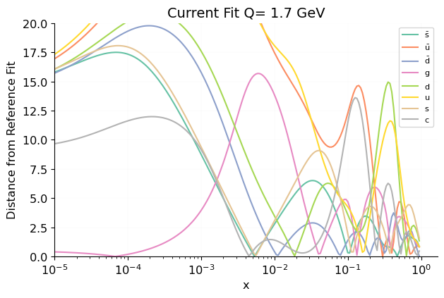 [.pdf](figures/Scales0_Normalize_Basespecs0_PDFscalespecs0_Distspecs0_plot_pdfdistances.pdf) [#](#Scales0_Normalize_Basespecs0_PDFscalespecs0_Distspecs0_plot_pdfdistances)](figures/Scales0_Normalize_Basespecs0_PDFscalespecs0_Distspecs0_plot_pdfdistances.png){#Scales0_Normalize_Basespecs0_PDFscalespecs0_Distspecs0_plot_pdfdistances} 

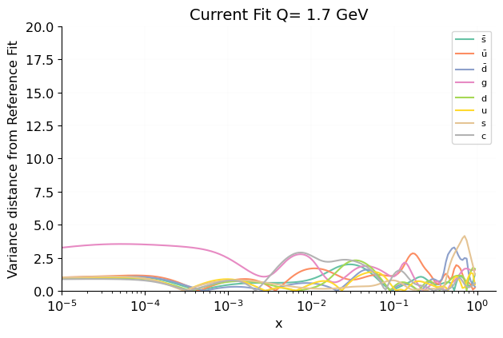 [.pdf](figures/Scales0_Normalize_Basespecs0_PDFscalespecs0_Distspecs0_plot_pdfvardistances.pdf) [#](#Scales0_Normalize_Basespecs0_PDFscalespecs0_Distspecs0_plot_pdfvardistances)](figures/Scales0_Normalize_Basespecs0_PDFscalespecs0_Distspecs0_plot_pdfvardistances.png){#Scales0_Normalize_Basespecs0_PDFscalespecs0_Distspecs0_plot_pdfvardistances} 

#### Flavour basis, Linear
 [.pdf](figures/Scales0_Normalize_Basespecs0_PDFscalespecs1_Distspecs0_plot_pdfdistances.pdf) [#](#Scales0_Normalize_Basespecs0_PDFscalespecs1_Distspecs0_plot_pdfdistances)](figures/Scales0_Normalize_Basespecs0_PDFscalespecs1_Distspecs0_plot_pdfdistances.png){#Scales0_Normalize_Basespecs0_PDFscalespecs1_Distspecs0_plot_pdfdistances} 

 [.pdf](figures/Scales0_Normalize_Basespecs0_PDFscalespecs1_Distspecs0_plot_pdfvardistances.pdf) [#](#Scales0_Normalize_Basespecs0_PDFscalespecs1_Distspecs0_plot_pdfvardistances)](figures/Scales0_Normalize_Basespecs0_PDFscalespecs1_Distspecs0_plot_pdfvardistances.png){#Scales0_Normalize_Basespecs0_PDFscalespecs1_Distspecs0_plot_pdfvardistances} 

#### Evolution basis, Log
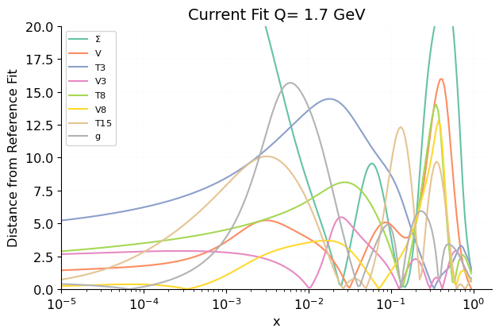 [.pdf](figures/Scales0_Normalize_Basespecs1_PDFscalespecs0_Distspecs0_plot_pdfdistances.pdf) [#](#Scales0_Normalize_Basespecs1_PDFscalespecs0_Distspecs0_plot_pdfdistances)](figures/Scales0_Normalize_Basespecs1_PDFscalespecs0_Distspecs0_plot_pdfdistances.png){#Scales0_Normalize_Basespecs1_PDFscalespecs0_Distspecs0_plot_pdfdistances} 

 [.pdf](figures/Scales0_Normalize_Basespecs1_PDFscalespecs0_Distspecs0_plot_pdfvardistances.pdf) [#](#Scales0_Normalize_Basespecs1_PDFscalespecs0_Distspecs0_plot_pdfvardistances)](figures/Scales0_Normalize_Basespecs1_PDFscalespecs0_Distspecs0_plot_pdfvardistances.png){#Scales0_Normalize_Basespecs1_PDFscalespecs0_Distspecs0_plot_pdfvardistances} 

#### Evolution basis, Linear
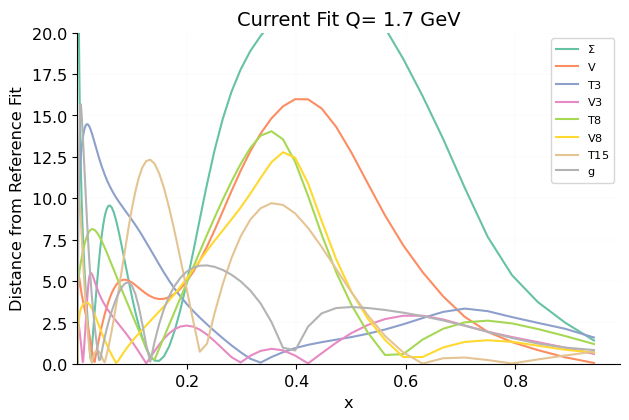 [.pdf](figures/Scales0_Normalize_Basespecs1_PDFscalespecs1_Distspecs0_plot_pdfdistances.pdf) [#](#Scales0_Normalize_Basespecs1_PDFscalespecs1_Distspecs0_plot_pdfdistances)](figures/Scales0_Normalize_Basespecs1_PDFscalespecs1_Distspecs0_plot_pdfdistances.png){#Scales0_Normalize_Basespecs1_PDFscalespecs1_Distspecs0_plot_pdfdistances} 

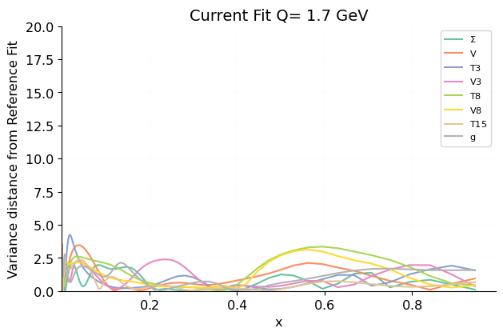 [.pdf](figures/Scales0_Normalize_Basespecs1_PDFscalespecs1_Distspecs0_plot_pdfvardistances.pdf) [#](#Scales0_Normalize_Basespecs1_PDFscalespecs1_Distspecs0_plot_pdfvardistances)](figures/Scales0_Normalize_Basespecs1_PDFscalespecs1_Distspecs0_plot_pdfvardistances.png){#Scales0_Normalize_Basespecs1_PDFscalespecs1_Distspecs0_plot_pdfvardistances} 

### Q = 100 GeV

#### Flavour basis, Log
 [.pdf](figures/Scales1_Normalize_Basespecs0_PDFscalespecs0_Distspecs0_plot_pdfdistances.pdf) [#](#Scales1_Normalize_Basespecs0_PDFscalespecs0_Distspecs0_plot_pdfdistances)](figures/Scales1_Normalize_Basespecs0_PDFscalespecs0_Distspecs0_plot_pdfdistances.png){#Scales1_Normalize_Basespecs0_PDFscalespecs0_Distspecs0_plot_pdfdistances} 

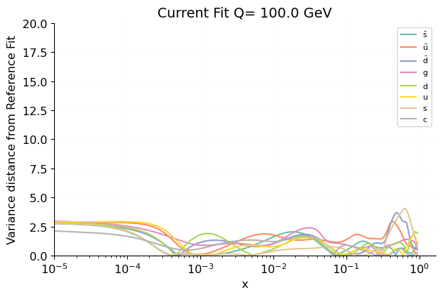 [.pdf](figures/Scales1_Normalize_Basespecs0_PDFscalespecs0_Distspecs0_plot_pdfvardistances.pdf) [#](#Scales1_Normalize_Basespecs0_PDFscalespecs0_Distspecs0_plot_pdfvardistances)](figures/Scales1_Normalize_Basespecs0_PDFscalespecs0_Distspecs0_plot_pdfvardistances.png){#Scales1_Normalize_Basespecs0_PDFscalespecs0_Distspecs0_plot_pdfvardistances} 

#### Flavour basis, Linear
 [.pdf](figures/Scales1_Normalize_Basespecs0_PDFscalespecs1_Distspecs0_plot_pdfdistances.pdf) [#](#Scales1_Normalize_Basespecs0_PDFscalespecs1_Distspecs0_plot_pdfdistances)](figures/Scales1_Normalize_Basespecs0_PDFscalespecs1_Distspecs0_plot_pdfdistances.png){#Scales1_Normalize_Basespecs0_PDFscalespecs1_Distspecs0_plot_pdfdistances} 

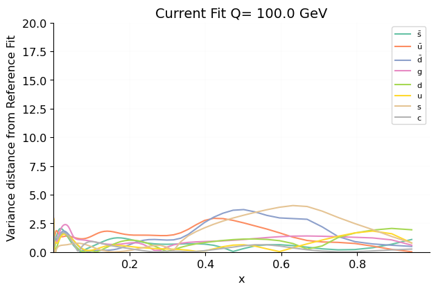 [.pdf](figures/Scales1_Normalize_Basespecs0_PDFscalespecs1_Distspecs0_plot_pdfvardistances.pdf) [#](#Scales1_Normalize_Basespecs0_PDFscalespecs1_Distspecs0_plot_pdfvardistances)](figures/Scales1_Normalize_Basespecs0_PDFscalespecs1_Distspecs0_plot_pdfvardistances.png){#Scales1_Normalize_Basespecs0_PDFscalespecs1_Distspecs0_plot_pdfvardistances} 

#### Evolution basis, Log
 [.pdf](figures/Scales1_Normalize_Basespecs1_PDFscalespecs0_Distspecs0_plot_pdfdistances.pdf) [#](#Scales1_Normalize_Basespecs1_PDFscalespecs0_Distspecs0_plot_pdfdistances)](figures/Scales1_Normalize_Basespecs1_PDFscalespecs0_Distspecs0_plot_pdfdistances.png){#Scales1_Normalize_Basespecs1_PDFscalespecs0_Distspecs0_plot_pdfdistances} 

 [.pdf](figures/Scales1_Normalize_Basespecs1_PDFscalespecs0_Distspecs0_plot_pdfvardistances.pdf) [#](#Scales1_Normalize_Basespecs1_PDFscalespecs0_Distspecs0_plot_pdfvardistances)](figures/Scales1_Normalize_Basespecs1_PDFscalespecs0_Distspecs0_plot_pdfvardistances.png){#Scales1_Normalize_Basespecs1_PDFscalespecs0_Distspecs0_plot_pdfvardistances} 

#### Evolution basis, Linear
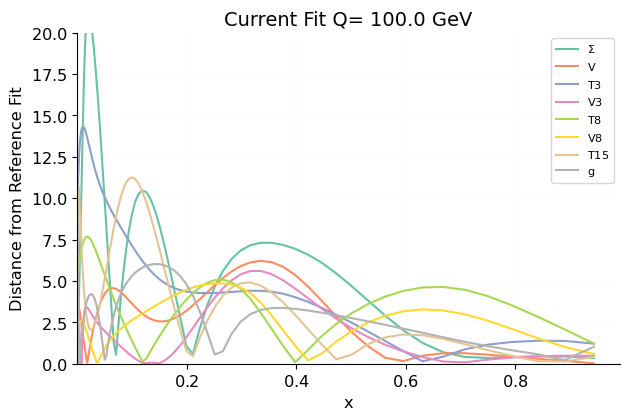 [.pdf](figures/Scales1_Normalize_Basespecs1_PDFscalespecs1_Distspecs0_plot_pdfdistances.pdf) [#](#Scales1_Normalize_Basespecs1_PDFscalespecs1_Distspecs0_plot_pdfdistances)](figures/Scales1_Normalize_Basespecs1_PDFscalespecs1_Distspecs0_plot_pdfdistances.png){#Scales1_Normalize_Basespecs1_PDFscalespecs1_Distspecs0_plot_pdfdistances} 

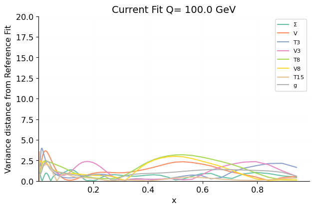 [.pdf](figures/Scales1_Normalize_Basespecs1_PDFscalespecs1_Distspecs0_plot_pdfvardistances.pdf) [#](#Scales1_Normalize_Basespecs1_PDFscalespecs1_Distspecs0_plot_pdfvardistances)](figures/Scales1_Normalize_Basespecs1_PDFscalespecs1_Distspecs0_plot_pdfvardistances.png){#Scales1_Normalize_Basespecs1_PDFscalespecs1_Distspecs0_plot_pdfvardistances} 

PDF arc-lengths
---------------
 [.pdf](figures/Basespecs0_plot_arc_lengths.pdf) [#](#Basespecs0_plot_arc_lengths)](figures/Basespecs0_plot_arc_lengths.png){#Basespecs0_plot_arc_lengths} 

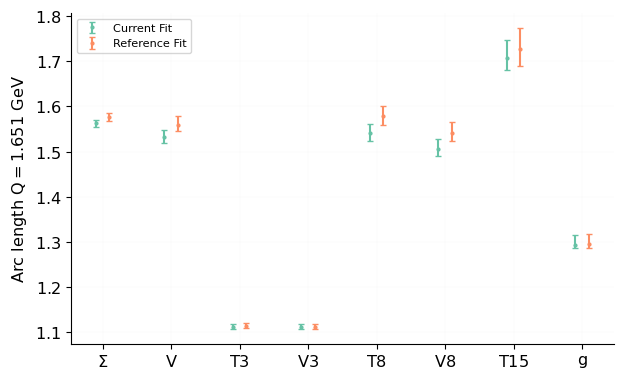 [.pdf](figures/Basespecs1_plot_arc_lengths.pdf) [#](#Basespecs1_plot_arc_lengths)](figures/Basespecs1_plot_arc_lengths.png){#Basespecs1_plot_arc_lengths} 

Sum rules
---------

### Current Fit

#### Known sum rules

<table class="dataframe">
<thead>
<tr style="text-align: right;">
<th></th>
<th>mean</th>
<th>std</th>
<th>min</th>
<th>max</th>
</tr>
</thead>
<tbody>
<tr>
<th>momentum</th>
<td>1.000</td>
<td>8.956E-7</td>
<td>1.000</td>
<td>1.000</td>
</tr>
<tr>
<th>uvalence</th>
<td>2.000</td>
<td>2.524E-6</td>
<td>2.000</td>
<td>2.000</td>
</tr>
<tr>
<th>dvalence</th>
<td>1.000</td>
<td>2.339E-6</td>
<td>1.000</td>
<td>1.000</td>
</tr>
<tr>
<th>svalence</th>
<td>1.313E-6</td>
<td>3.414E-6</td>
<td>-1.794E-5</td>
<td>1.257E-5</td>
</tr>
<tr>
<th>cvalence</th>
<td>4.959E-10</td>
<td>1.066E-7</td>
<td>-3.851E-7</td>
<td>4.320E-7</td>
</tr>
</tbody>
</table>

#### Unknown sum rules

<table class="dataframe">
<thead>
<tr style="text-align: right;">
<th></th>
<th>mean</th>
<th>std</th>
</tr>
</thead>
<tbody>
<tr>
<th>u momentum fraction</th>
<td>0.3587</td>
<td>0.0036</td>
</tr>
<tr>
<th>ubar momentum fraction</th>
<td>0.0304</td>
<td>0.0013</td>
</tr>
<tr>
<th>d momentum fraction</th>
<td>0.1645</td>
<td>0.0030</td>
</tr>
<tr>
<th>dbar momentum fraction</th>
<td>0.0397</td>
<td>0.0015</td>
</tr>
<tr>
<th>s momentum fraction</th>
<td>0.0231</td>
<td>0.0025</td>
</tr>
<tr>
<th>sbar momentum fraction</th>
<td>0.0176</td>
<td>0.0013</td>
</tr>
<tr>
<th>cp momentum fraction</th>
<td>-0.0176</td>
<td>0.0036</td>
</tr>
<tr>
<th>cm momentum fraction</th>
<td>-5E-11</td>
<td>7.5E-10</td>
</tr>
<tr>
<th>g momentum fraction</th>
<td>0.3837</td>
<td>0.0040</td>
</tr>
<tr>
<th>T3</th>
<td>0.90</td>
<td>0.20</td>
</tr>
<tr>
<th>T8</th>
<td>4.83</td>
<td>0.76</td>
</tr>
</tbody>
</table>

### Reference Fit

#### Known sum rules

<table class="dataframe">
<thead>
<tr style="text-align: right;">
<th></th>
<th>mean</th>
<th>std</th>
<th>min</th>
<th>max</th>
</tr>
</thead>
<tbody>
<tr>
<th>momentum</th>
<td>1.000</td>
<td>2.161E-6</td>
<td>1.000</td>
<td>1.000</td>
</tr>
<tr>
<th>uvalence</th>
<td>2.000</td>
<td>1.835E-6</td>
<td>2.000</td>
<td>2.000</td>
</tr>
<tr>
<th>dvalence</th>
<td>1.000</td>
<td>2.449E-6</td>
<td>1.000</td>
<td>1.000</td>
</tr>
<tr>
<th>svalence</th>
<td>1.958E-6</td>
<td>2.924E-6</td>
<td>-5.937E-6</td>
<td>1.226E-5</td>
</tr>
<tr>
<th>cvalence</th>
<td>-1.191E-8</td>
<td>6.667E-8</td>
<td>-1.717E-7</td>
<td>2.583E-7</td>
</tr>
</tbody>
</table>

#### Unknown sum rules

<table class="dataframe">
<thead>
<tr style="text-align: right;">
<th></th>
<th>mean</th>
<th>std</th>
</tr>
</thead>
<tbody>
<tr>
<th>u momentum fraction</th>
<td>0.3611</td>
<td>0.0035</td>
</tr>
<tr>
<th>ubar momentum fraction</th>
<td>0.0279</td>
<td>0.0011</td>
</tr>
<tr>
<th>d momentum fraction</th>
<td>0.1685</td>
<td>0.0028</td>
</tr>
<tr>
<th>dbar momentum fraction</th>
<td>0.0395</td>
<td>0.0017</td>
</tr>
<tr>
<th>s momentum fraction</th>
<td>0.0240</td>
<td>0.0028</td>
</tr>
<tr>
<th>sbar momentum fraction</th>
<td>0.0180</td>
<td>0.0015</td>
</tr>
<tr>
<th>cp momentum fraction</th>
<td>-0.0164</td>
<td>0.0039</td>
</tr>
<tr>
<th>cm momentum fraction</th>
<td>-8.29E-8</td>
<td>1.3E-9</td>
</tr>
<tr>
<th>g momentum fraction</th>
<td>0.3775</td>
<td>0.0037</td>
</tr>
<tr>
<th>T3</th>
<td>0.54</td>
<td>0.33</td>
</tr>
<tr>
<th>T8</th>
<td>4.29</td>
<td>0.85</td>
</tr>
</tbody>
</table>

PDF plots
---------

[Plots at Q = 1.65 GeV](Scales0_pdf_report_report.html)

[Plots at Q = 100 GeV](Scales1_pdf_report_report.html)

Luminosities
------------

[Plots at 13 TeV](Energies0_lumi_report_report.html)

Effective exponents
-------------------
[Detailed information](exponents_report_report.html)

Training lengths
----------------
 [.pdf](figures/CurrentFit_plot_training_length.pdf) [#](#CurrentFit_plot_training_length)](figures/CurrentFit_plot_training_length.png){#CurrentFit_plot_training_length} 

 [.pdf](figures/ReferenceFit_plot_training_length.pdf) [#](#ReferenceFit_plot_training_length)](figures/ReferenceFit_plot_training_length.png){#ReferenceFit_plot_training_length} 

Training-validation
-------------------
 [.pdf](figures/CurrentFit_plot_training_validation.pdf) [#](#CurrentFit_plot_training_validation)](figures/CurrentFit_plot_training_validation.png){#CurrentFit_plot_training_validation} 

 [.pdf](figures/ReferenceFit_plot_training_validation.pdf) [#](#ReferenceFit_plot_training_validation)](figures/ReferenceFit_plot_training_validation.png){#ReferenceFit_plot_training_validation} 

$\chi^2$ by nnpdf31_process
----------------------------------------
 [.pdf](figures/DataGroups0_plot_fits_groups_data_chi2.pdf) [#](#DataGroups0_plot_fits_groups_data_chi2)](figures/DataGroups0_plot_fits_groups_data_chi2.png){#DataGroups0_plot_fits_groups_data_chi2} 

$\chi^2$ by experiment
----------------------------------------
 [.pdf](figures/DataGroups1_plot_fits_groups_data_chi2.pdf) [#](#DataGroups1_plot_fits_groups_data_chi2)](figures/DataGroups1_plot_fits_groups_data_chi2.png){#DataGroups1_plot_fits_groups_data_chi2} 

$\chi^2$ by dataset
-------------------
### Plot
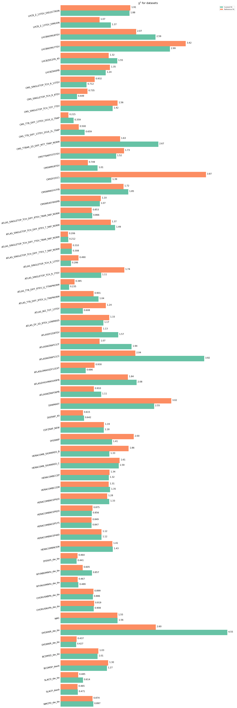 [.pdf](figures/plot_fits_datasets_chi2.pdf) [#](#plot_fits_datasets_chi2)](figures/plot_fits_datasets_chi2.png){#plot_fits_datasets_chi2} 

### Table
<table class="dataframe">
<thead>
<tr>
<th></th>
<th></th>
<th colspan="2" halign="left">Current Fit</th>
<th colspan="2" halign="left">Reference Fit</th>
</tr>
<tr>
<th></th>
<th></th>
<th>ndata</th>
<th>$\chi^2/ndata$</th>
<th>ndata</th>
<th>$\chi^2/ndata$</th>
</tr>
</thead>
<tbody>
<tr>
<th rowspan="8" valign="top">DEUTERON</th>
<th>Total</th>
<td>627</td>
<td>1.176</td>
<td>627</td>
<td>1.165</td>
</tr>
<tr>
<th>NMCPD_dw_ite</th>
<td>64</td>
<td>0.8968</td>
<td>64</td>
<td>0.8736</td>
</tr>
<tr>
<th>SLACP_dwsh</th>
<td>6</td>
<td>0.4712</td>
<td>6</td>
<td>0.4654</td>
</tr>
<tr>
<th>SLACD_dw_ite</th>
<td>6</td>
<td>0.6141</td>
<td>6</td>
<td>0.4849</td>
</tr>
<tr>
<th>BCDMSP_dwsh</th>
<td>296</td>
<td>1.266</td>
<td>296</td>
<td>1.300</td>
</tr>
<tr>
<th>BCDMSD_dw_ite</th>
<td>234</td>
<td>1.012</td>
<td>234</td>
<td>1.035</td>
</tr>
<tr>
<th>DYE886R_dw_ite</th>
<td>15</td>
<td>0.4268</td>
<td>15</td>
<td>0.4375</td>
</tr>
<tr>
<th>DYE906R_dw_ite</th>
<td>6</td>
<td>4.551</td>
<td>6</td>
<td>2.600</td>
</tr>
<tr>
<th rowspan="2" valign="top">NMC</th>
<th>Total</th>
<td>70</td>
<td>1.557</td>
<td>70</td>
<td>1.552</td>
</tr>
<tr>
<th>NMC</th>
<td>70</td>
<td>1.557</td>
<td>70</td>
<td>1.552</td>
</tr>
<tr>
<th rowspan="6" valign="top">NUCLEAR</th>
<th>Total</th>
<td>556</td>
<td>0.8067</td>
<td>556</td>
<td>0.8118</td>
</tr>
<tr>
<th>CHORUSNUPb_dw_ite</th>
<td>215</td>
<td>0.9078</td>
<td>215</td>
<td>0.9194</td>
</tr>
<tr>
<th>CHORUSNBPb_dw_ite</th>
<td>215</td>
<td>0.8858</td>
<td>215</td>
<td>0.8992</td>
</tr>
<tr>
<th>NTVNUDMNFe_dw_ite</th>
<td>25</td>
<td>0.4892</td>
<td>25</td>
<td>0.4674</td>
</tr>
<tr>
<th>NTVNBDMNFe_dw_ite</th>
<td>16</td>
<td>0.8572</td>
<td>16</td>
<td>0.6048</td>
</tr>
<tr>
<th>DYE605_dw_ite</th>
<td>85</td>
<td>0.4406</td>
<td>85</td>
<td>0.4642</td>
</tr>
<tr>
<th rowspan="10" valign="top">HERACOMB</th>
<th>Total</th>
<td>1018</td>
<td>1.196</td>
<td>1018</td>
<td>1.189</td>
</tr>
<tr>
<th>HERACOMBNCEM</th>
<td>159</td>
<td>1.426</td>
<td>159</td>
<td>1.414</td>
</tr>
<tr>
<th>HERACOMBNCEP460</th>
<td>167</td>
<td>1.118</td>
<td>167</td>
<td>1.120</td>
</tr>
<tr>
<th>HERACOMBNCEP575</th>
<td>206</td>
<td>0.8473</td>
<td>206</td>
<td>0.8489</td>
</tr>
<tr>
<th>HERACOMBNCEP820</th>
<td>56</td>
<td>0.8559</td>
<td>56</td>
<td>0.8747</td>
</tr>
<tr>
<th>HERACOMBNCEP920</th>
<td>298</td>
<td>1.330</td>
<td>298</td>
<td>1.276</td>
</tr>
<tr>
<th>HERACOMBCCEM</th>
<td>42</td>
<td>1.352</td>
<td>42</td>
<td>1.315</td>
</tr>
<tr>
<th>HERACOMBCCEP</th>
<td>39</td>
<td>1.318</td>
<td>39</td>
<td>1.337</td>
</tr>
<tr>
<th>HERACOMB_SIGMARED_C</th>
<td>31</td>
<td>1.588</td>
<td>31</td>
<td>1.612</td>
</tr>
<tr>
<th>HERACOMB_SIGMARED_B</th>
<td>20</td>
<td>1.333</td>
<td>20</td>
<td>1.857</td>
</tr>
<tr>
<th rowspan="2" valign="top">DYE886</th>
<th>Total</th>
<td>89</td>
<td>1.407</td>
<td>89</td>
<td>1.998</td>
</tr>
<tr>
<th>DYE886P</th>
<td>89</td>
<td>1.407</td>
<td>89</td>
<td>1.998</td>
</tr>
<tr>
<th rowspan="2" valign="top">CDF</th>
<th>Total</th>
<td>28</td>
<td>1.180</td>
<td>28</td>
<td>1.186</td>
</tr>
<tr>
<th>CDFZRAP_NEW</th>
<td>28</td>
<td>1.180</td>
<td>28</td>
<td>1.186</td>
</tr>
<tr>
<th rowspan="3" valign="top">D0</th>
<th>Total</th>
<td>38</td>
<td>1.146</td>
<td>37</td>
<td>1.201</td>
</tr>
<tr>
<th>D0ZRAP_40</th>
<td>28</td>
<td>0.6422</td>
<td>28</td>
<td>0.6145</td>
</tr>
<tr>
<th>D0WMASY</th>
<td>10</td>
<td>2.555</td>
<td>9</td>
<td>3.024</td>
</tr>
<tr>
<th rowspan="17" valign="top">ATLAS</th>
<th>Total</th>
<td>233</td>
<td>1.807</td>
<td>235</td>
<td>1.301</td>
</tr>
<tr>
<th>ATLASWZRAP36PB</th>
<td>30</td>
<td>1.110</td>
<td>30</td>
<td>0.9096</td>
</tr>
<tr>
<th>ATLASZHIGHMASS49FB</th>
<td>5</td>
<td>2.077</td>
<td>5</td>
<td>1.840</td>
</tr>
<tr>
<th>ATLASLOMASSDY11EXT</th>
<td>4</td>
<td>0.6861</td>
<td>6</td>
<td>0.9304</td>
</tr>
<tr>
<th>ATLASWZRAP11CC</th>
<td>46</td>
<td>3.921</td>
<td>46</td>
<td>2.043</td>
</tr>
<tr>
<th>ATLASWZRAP11CF</th>
<td>15</td>
<td>1.939</td>
<td>15</td>
<td>1.066</td>
</tr>
<tr>
<th>ATLASDY2D8TEV</th>
<td>48</td>
<td>1.574</td>
<td>48</td>
<td>1.130</td>
</tr>
<tr>
<th>ATLAS_DY_2D_8TEV_LOWMASS</th>
<td>60</td>
<td>1.169</td>
<td>60</td>
<td>1.329</td>
</tr>
<tr>
<th>ATLAS_WZ_TOT_13TEV</th>
<td>3</td>
<td>0.6083</td>
<td>3</td>
<td>1.239</td>
</tr>
<tr>
<th>ATLAS_TTB_DIFF_8TEV_LJ_TRAPNORM</th>
<td>4</td>
<td>1.035</td>
<td>4</td>
<td>0.9013</td>
</tr>
<tr>
<th>ATLAS_TTB_DIFF_8TEV_LJ_TTRAPNORM</th>
<td>4</td>
<td>0.2345</td>
<td>4</td>
<td>0.3847</td>
</tr>
<tr>
<th>ATLAS_SINGLETOP_TCH_R_7TEV</th>
<td>1</td>
<td>1.110</td>
<td>1</td>
<td>1.741</td>
</tr>
<tr>
<th>ATLAS_SINGLETOP_TCH_R_13TEV</th>
<td>1</td>
<td>0.2864</td>
<td>1</td>
<td>0.4900</td>
</tr>
<tr>
<th>ATLAS_SINGLETOP_TCH_DIFF_7TEV_T_RAP_NORM</th>
<td>3</td>
<td>0.3084</td>
<td>3</td>
<td>0.3098</td>
</tr>
<tr>
<th>ATLAS_SINGLETOP_TCH_DIFF_7TEV_TBAR_RAP_NORM</th>
<td>3</td>
<td>0.2122</td>
<td>3</td>
<td>0.2062</td>
</tr>
<tr>
<th>ATLAS_SINGLETOP_TCH_DIFF_8TEV_T_RAP_NORM</th>
<td>3</td>
<td>1.489</td>
<td>3</td>
<td>1.373</td>
</tr>
<tr>
<th>ATLAS_SINGLETOP_TCH_DIFF_8TEV_TBAR_RAP_NORM</th>
<td>3</td>
<td>0.8664</td>
<td>3</td>
<td>0.8529</td>
</tr>
<tr>
<th rowspan="12" valign="top">CMS</th>
<th>Total</th>
<td>172</td>
<td>1.343</td>
<td>194</td>
<td>2.684</td>
</tr>
<tr>
<th>CMSWEASY840PB</th>
<td>11</td>
<td>1.073</td>
<td>11</td>
<td>1.100</td>
</tr>
<tr>
<th>CMSWMASY47FB</th>
<td>11</td>
<td>1.849</td>
<td>11</td>
<td>1.718</td>
</tr>
<tr>
<th>CMSDY2D11</th>
<td>88</td>
<td>1.387</td>
<td>110</td>
<td>3.970</td>
</tr>
<tr>
<th>CMSWMU8TEV</th>
<td>22</td>
<td>1.012</td>
<td>22</td>
<td>0.7488</td>
</tr>
<tr>
<th>CMSTTBARTOT5TEV</th>
<td>1</td>
<td>1.519</td>
<td>1</td>
<td>1.733</td>
</tr>
<tr>
<th>CMS_TTBAR_2D_DIFF_MTT_TRAP_NORM</th>
<td>15</td>
<td>2.672</td>
<td>15</td>
<td>1.625</td>
</tr>
<tr>
<th>CMS_TTB_DIFF_13TEV_2016_2L_TRAP</th>
<td>10</td>
<td>0.6591</td>
<td>10</td>
<td>0.5000</td>
</tr>
<tr>
<th>CMS_TTB_DIFF_13TEV_2016_LJ_TRAP</th>
<td>11</td>
<td>0.3586</td>
<td>11</td>
<td>0.2150</td>
</tr>
<tr>
<th>CMS_SINGLETOP_TCH_TOT_7TEV</th>
<td>1</td>
<td>1.424</td>
<td>1</td>
<td>1.556</td>
</tr>
<tr>
<th>CMS_SINGLETOP_TCH_R_8TEV</th>
<td>1</td>
<td>0.4491</td>
<td>1</td>
<td>0.7350</td>
</tr>
<tr>
<th>CMS_SINGLETOP_TCH_R_13TEV</th>
<td>1</td>
<td>0.7120</td>
<td>1</td>
<td>0.9315</td>
</tr>
<tr>
<th rowspan="7" valign="top">LHCb</th>
<th>Total</th>
<td>128</td>
<td>2.203</td>
<td>116</td>
<td>2.088</td>
</tr>
<tr>
<th>LHCBZ940PB</th>
<td>9</td>
<td>1.235</td>
<td>9</td>
<td>1.350</td>
</tr>
<tr>
<th>LHCBZEE2FB_40</th>
<td>17</td>
<td>1.548</td>
<td>17</td>
<td>1.317</td>
</tr>
<tr>
<th>LHCBWZMU7TEV</th>
<td>33</td>
<td>2.987</td>
<td>29</td>
<td>3.418</td>
</tr>
<tr>
<th>LHCBWZMU8TEV</th>
<td>34</td>
<td>2.592</td>
<td>30</td>
<td>2.066</td>
</tr>
<tr>
<th>LHCB_Z_13TEV_DIMUON</th>
<td>18</td>
<td>1.374</td>
<td>16</td>
<td>1.066</td>
</tr>
<tr>
<th>LHCB_Z_13TEV_DIELECTRON</th>
<td>17</td>
<td>1.882</td>
<td>15</td>
<td>1.906</td>
</tr>
<tr>
<th>Total</th>
<th>Total</th>
<td>2959</td>
<td>1.233</td>
<td>2970</td>
<td>1.288</td>
</tr>
</tbody>
</table>

$\phi$ by nnpdf31_process
--------------------------------------
 [.pdf](figures/DataGroups0_plot_fits_groups_data_phi.pdf) [#](#DataGroups0_plot_fits_groups_data_phi)](figures/DataGroups0_plot_fits_groups_data_phi.png){#DataGroups0_plot_fits_groups_data_phi} 

$\phi$ by experiment
--------------------------------------
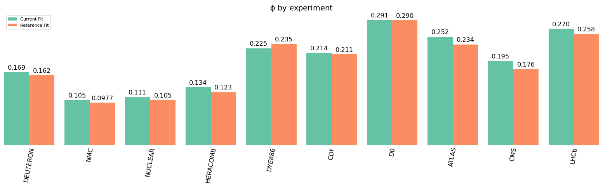 [.pdf](figures/DataGroups1_plot_fits_groups_data_phi.pdf) [#](#DataGroups1_plot_fits_groups_data_phi)](figures/DataGroups1_plot_fits_groups_data_phi.png){#DataGroups1_plot_fits_groups_data_phi} 

Dataset plots
-------------

[Plots for CHORUSNBPb_dw_ite](matched_datasets_from_dataspecs0_dataset_report_report.html)

[Plots for CHORUSNUPb_dw_ite](matched_datasets_from_dataspecs1_dataset_report_report.html)

[Plots for HERACOMBCCEM](matched_datasets_from_dataspecs2_dataset_report_report.html)

[Plots for HERACOMBCCEP](matched_datasets_from_dataspecs3_dataset_report_report.html)

[Plots for NTVNBDMNFe_dw_ite](matched_datasets_from_dataspecs4_dataset_report_report.html)

[Plots for NTVNUDMNFe_dw_ite](matched_datasets_from_dataspecs5_dataset_report_report.html)

[Plots for BCDMSD_dw_ite](matched_datasets_from_dataspecs6_dataset_report_report.html)

[Plots for BCDMSP_dwsh](matched_datasets_from_dataspecs7_dataset_report_report.html)

[Plots for HERACOMBNCEM](matched_datasets_from_dataspecs8_dataset_report_report.html)

[Plots for HERACOMBNCEP460](matched_datasets_from_dataspecs9_dataset_report_report.html)

[Plots for HERACOMBNCEP575](matched_datasets_from_dataspecs10_dataset_report_report.html)

[Plots for HERACOMBNCEP820](matched_datasets_from_dataspecs11_dataset_report_report.html)

[Plots for HERACOMBNCEP920](matched_datasets_from_dataspecs12_dataset_report_report.html)

[Plots for HERACOMB_SIGMARED_B](matched_datasets_from_dataspecs13_dataset_report_report.html)

[Plots for HERACOMB_SIGMARED_C](matched_datasets_from_dataspecs14_dataset_report_report.html)

[Plots for NMC](matched_datasets_from_dataspecs15_dataset_report_report.html)

[Plots for NMCPD_dw_ite](matched_datasets_from_dataspecs16_dataset_report_report.html)

[Plots for SLACD_dw_ite](matched_datasets_from_dataspecs17_dataset_report_report.html)

[Plots for SLACP_dwsh](matched_datasets_from_dataspecs18_dataset_report_report.html)

[Plots for ATLASDY2D8TEV](matched_datasets_from_dataspecs19_dataset_report_report.html)

[Plots for ATLASLOMASSDY11EXT](matched_datasets_from_dataspecs20_dataset_report_report.html)

[Plots for ATLASWZRAP11CC](matched_datasets_from_dataspecs21_dataset_report_report.html)

[Plots for ATLASWZRAP11CF](matched_datasets_from_dataspecs22_dataset_report_report.html)

[Plots for ATLASWZRAP36PB](matched_datasets_from_dataspecs23_dataset_report_report.html)

[Plots for ATLASZHIGHMASS49FB](matched_datasets_from_dataspecs24_dataset_report_report.html)

[Plots for ATLAS_DY_2D_8TEV_LOWMASS](matched_datasets_from_dataspecs25_dataset_report_report.html)

[Plots for ATLAS_WZ_TOT_13TEV](matched_datasets_from_dataspecs26_dataset_report_report.html)

[Plots for CDFZRAP_NEW](matched_datasets_from_dataspecs27_dataset_report_report.html)

[Plots for CMSDY2D11](matched_datasets_from_dataspecs28_dataset_report_report.html)

[Plots for CMSWEASY840PB](matched_datasets_from_dataspecs29_dataset_report_report.html)

[Plots for CMSWMASY47FB](matched_datasets_from_dataspecs30_dataset_report_report.html)

[Plots for CMSWMU8TEV](matched_datasets_from_dataspecs31_dataset_report_report.html)

[Plots for D0WMASY](matched_datasets_from_dataspecs32_dataset_report_report.html)

[Plots for D0ZRAP_40](matched_datasets_from_dataspecs33_dataset_report_report.html)

[Plots for DYE605_dw_ite](matched_datasets_from_dataspecs34_dataset_report_report.html)

[Plots for DYE886P](matched_datasets_from_dataspecs35_dataset_report_report.html)

[Plots for DYE886R_dw_ite](matched_datasets_from_dataspecs36_dataset_report_report.html)

[Plots for DYE906R_dw_ite](matched_datasets_from_dataspecs37_dataset_report_report.html)

[Plots for LHCBWZMU7TEV](matched_datasets_from_dataspecs38_dataset_report_report.html)

[Plots for LHCBWZMU8TEV](matched_datasets_from_dataspecs39_dataset_report_report.html)

[Plots for LHCBZ940PB](matched_datasets_from_dataspecs40_dataset_report_report.html)

[Plots for LHCBZEE2FB_40](matched_datasets_from_dataspecs41_dataset_report_report.html)

[Plots for LHCB_Z_13TEV_DIELECTRON](matched_datasets_from_dataspecs42_dataset_report_report.html)

[Plots for LHCB_Z_13TEV_DIMUON](matched_datasets_from_dataspecs43_dataset_report_report.html)

[Plots for ATLAS_SINGLETOP_TCH_DIFF_7TEV_TBAR_RAP_NORM](matched_datasets_from_dataspecs44_dataset_report_report.html)

[Plots for ATLAS_SINGLETOP_TCH_DIFF_7TEV_T_RAP_NORM](matched_datasets_from_dataspecs45_dataset_report_report.html)

[Plots for ATLAS_SINGLETOP_TCH_DIFF_8TEV_TBAR_RAP_NORM](matched_datasets_from_dataspecs46_dataset_report_report.html)

[Plots for ATLAS_SINGLETOP_TCH_DIFF_8TEV_T_RAP_NORM](matched_datasets_from_dataspecs47_dataset_report_report.html)

[Plots for ATLAS_SINGLETOP_TCH_R_13TEV](matched_datasets_from_dataspecs48_dataset_report_report.html)

[Plots for ATLAS_SINGLETOP_TCH_R_7TEV](matched_datasets_from_dataspecs49_dataset_report_report.html)

[Plots for CMS_SINGLETOP_TCH_R_13TEV](matched_datasets_from_dataspecs50_dataset_report_report.html)

[Plots for CMS_SINGLETOP_TCH_R_8TEV](matched_datasets_from_dataspecs51_dataset_report_report.html)

[Plots for CMS_SINGLETOP_TCH_TOT_7TEV](matched_datasets_from_dataspecs52_dataset_report_report.html)

[Plots for ATLAS_TTB_DIFF_8TEV_LJ_TRAPNORM](matched_datasets_from_dataspecs53_dataset_report_report.html)

[Plots for ATLAS_TTB_DIFF_8TEV_LJ_TTRAPNORM](matched_datasets_from_dataspecs54_dataset_report_report.html)

[Plots for CMSTTBARTOT5TEV](matched_datasets_from_dataspecs55_dataset_report_report.html)

[Plots for CMS_TTBAR_2D_DIFF_MTT_TRAP_NORM](matched_datasets_from_dataspecs56_dataset_report_report.html)

[Plots for CMS_TTB_DIFF_13TEV_2016_2L_TRAP](matched_datasets_from_dataspecs57_dataset_report_report.html)

[Plots for CMS_TTB_DIFF_13TEV_2016_LJ_TRAP](matched_datasets_from_dataspecs58_dataset_report_report.html)

Positivity
----------

 [.pdf](figures/matched_positivity_from_dataspecs0_plot_dataspecs_positivity.pdf) [#](#matched_positivity_from_dataspecs0_plot_dataspecs_positivity)](figures/matched_positivity_from_dataspecs0_plot_dataspecs_positivity.png){#matched_positivity_from_dataspecs0_plot_dataspecs_positivity} 

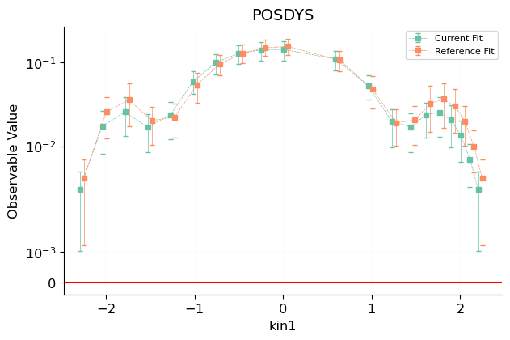 [.pdf](figures/matched_positivity_from_dataspecs1_plot_dataspecs_positivity.pdf) [#](#matched_positivity_from_dataspecs1_plot_dataspecs_positivity)](figures/matched_positivity_from_dataspecs1_plot_dataspecs_positivity.png){#matched_positivity_from_dataspecs1_plot_dataspecs_positivity} 

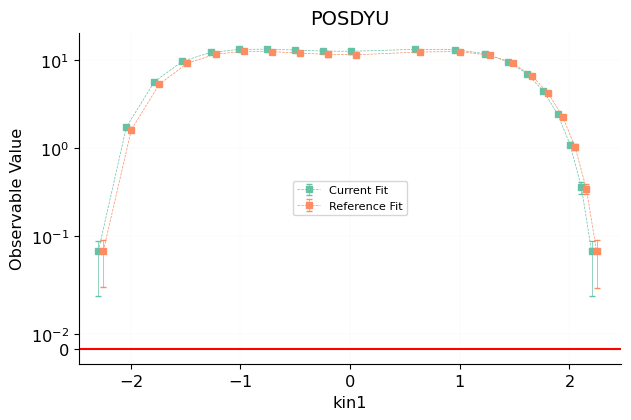 [.pdf](figures/matched_positivity_from_dataspecs2_plot_dataspecs_positivity.pdf) [#](#matched_positivity_from_dataspecs2_plot_dataspecs_positivity)](figures/matched_positivity_from_dataspecs2_plot_dataspecs_positivity.png){#matched_positivity_from_dataspecs2_plot_dataspecs_positivity} 

 [.pdf](figures/matched_positivity_from_dataspecs3_plot_dataspecs_positivity.pdf) [#](#matched_positivity_from_dataspecs3_plot_dataspecs_positivity)](figures/matched_positivity_from_dataspecs3_plot_dataspecs_positivity.png){#matched_positivity_from_dataspecs3_plot_dataspecs_positivity} 

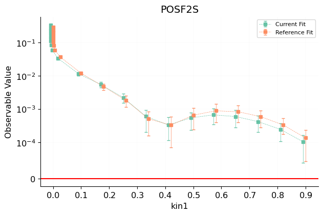 [.pdf](figures/matched_positivity_from_dataspecs4_plot_dataspecs_positivity.pdf) [#](#matched_positivity_from_dataspecs4_plot_dataspecs_positivity)](figures/matched_positivity_from_dataspecs4_plot_dataspecs_positivity.png){#matched_positivity_from_dataspecs4_plot_dataspecs_positivity} 

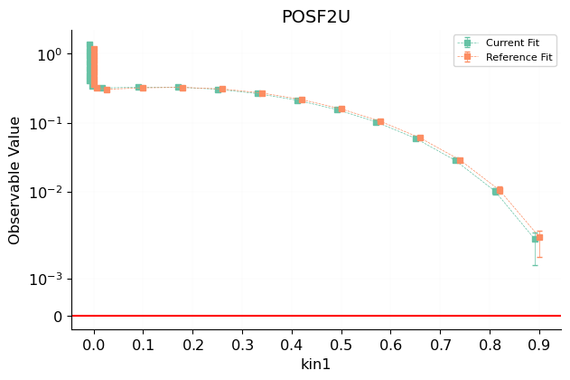 [.pdf](figures/matched_positivity_from_dataspecs5_plot_dataspecs_positivity.pdf) [#](#matched_positivity_from_dataspecs5_plot_dataspecs_positivity)](figures/matched_positivity_from_dataspecs5_plot_dataspecs_positivity.png){#matched_positivity_from_dataspecs5_plot_dataspecs_positivity} 

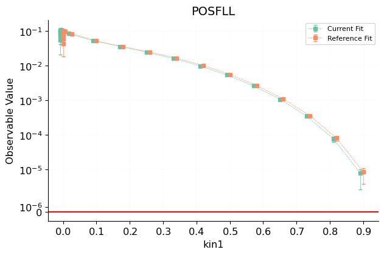 [.pdf](figures/matched_positivity_from_dataspecs6_plot_dataspecs_positivity.pdf) [#](#matched_positivity_from_dataspecs6_plot_dataspecs_positivity)](figures/matched_positivity_from_dataspecs6_plot_dataspecs_positivity.png){#matched_positivity_from_dataspecs6_plot_dataspecs_positivity} 

 [.pdf](figures/matched_positivity_from_dataspecs7_plot_dataspecs_positivity.pdf) [#](#matched_positivity_from_dataspecs7_plot_dataspecs_positivity)](figures/matched_positivity_from_dataspecs7_plot_dataspecs_positivity.png){#matched_positivity_from_dataspecs7_plot_dataspecs_positivity} 

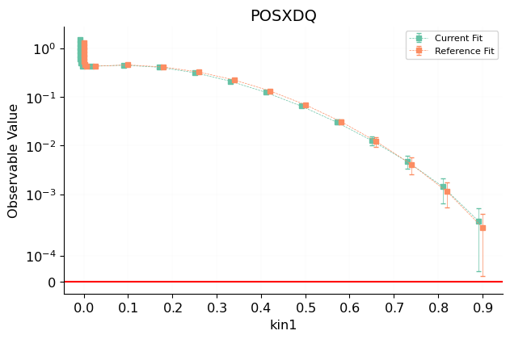 [.pdf](figures/matched_positivity_from_dataspecs8_plot_dataspecs_positivity.pdf) [#](#matched_positivity_from_dataspecs8_plot_dataspecs_positivity)](figures/matched_positivity_from_dataspecs8_plot_dataspecs_positivity.png){#matched_positivity_from_dataspecs8_plot_dataspecs_positivity} 

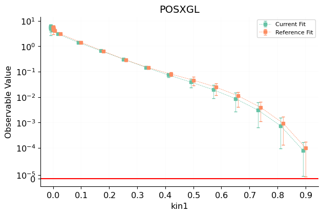 [.pdf](figures/matched_positivity_from_dataspecs9_plot_dataspecs_positivity.pdf) [#](#matched_positivity_from_dataspecs9_plot_dataspecs_positivity)](figures/matched_positivity_from_dataspecs9_plot_dataspecs_positivity.png){#matched_positivity_from_dataspecs9_plot_dataspecs_positivity} 

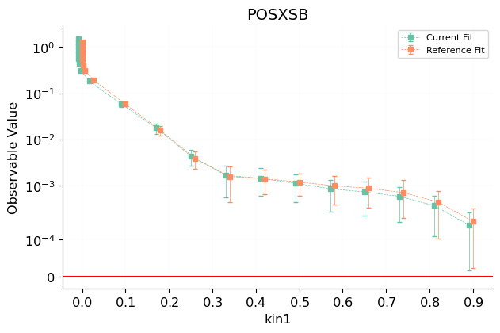 [.pdf](figures/matched_positivity_from_dataspecs10_plot_dataspecs_positivity.pdf) [#](#matched_positivity_from_dataspecs10_plot_dataspecs_positivity)](figures/matched_positivity_from_dataspecs10_plot_dataspecs_positivity.png){#matched_positivity_from_dataspecs10_plot_dataspecs_positivity} 

 [.pdf](figures/matched_positivity_from_dataspecs11_plot_dataspecs_positivity.pdf) [#](#matched_positivity_from_dataspecs11_plot_dataspecs_positivity)](figures/matched_positivity_from_dataspecs11_plot_dataspecs_positivity.png){#matched_positivity_from_dataspecs11_plot_dataspecs_positivity} 

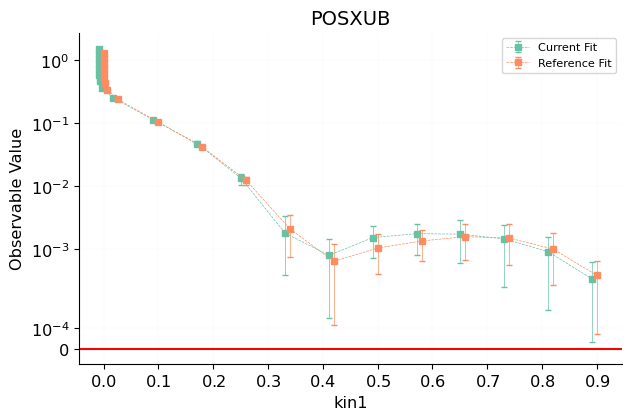 [.pdf](figures/matched_positivity_from_dataspecs12_plot_dataspecs_positivity.pdf) [#](#matched_positivity_from_dataspecs12_plot_dataspecs_positivity)](figures/matched_positivity_from_dataspecs12_plot_dataspecs_positivity.png){#matched_positivity_from_dataspecs12_plot_dataspecs_positivity} 

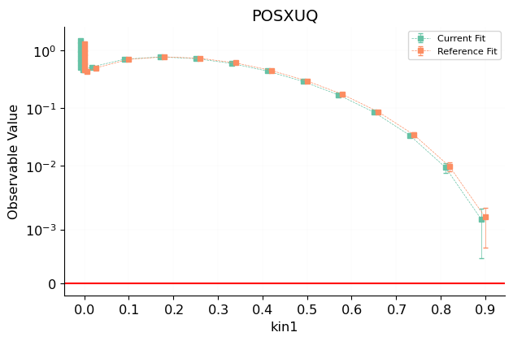 [.pdf](figures/matched_positivity_from_dataspecs13_plot_dataspecs_positivity.pdf) [#](#matched_positivity_from_dataspecs13_plot_dataspecs_positivity)](figures/matched_positivity_from_dataspecs13_plot_dataspecs_positivity.png){#matched_positivity_from_dataspecs13_plot_dataspecs_positivity} 

Dataset differences and cuts
----------------------------
The following datasets are included in both `Current Fit` and `Reference Fit`:

 - NMC $d/p$
 - ATLAS single top $R_{t}$ 7 TeV
 - ATLAS low-mass DY 2011
 - ATLAS $W,Z$ inclusive 13 TeV
 - CHORUS $\sigma_{CC}^{\nu}$
 - CMS $t\bar{t}$ double differential $(m_{t\bar{t}},y_{t})$
 - HERA I+II inclusive NC $e^-p$
 - ATLAS single top $y_t$ (normalised)
 - BCDMS $p$
 - ATLAS DY 2D 8 TeV high mass
 - CMS $W$ rapidity 8 TeV
 - CMS $t\bar{t}$ absolute $y_t$
 - LHCb $Z\to \mu\mu$
 - CMS Drell-Yan 2D 7 TeV 2011
 - SLAC $p$
 - D0 $W\to \mu\nu$ asymmetry
 - ATLAS $W,Z$ 7 TeV 2011 Forward selection
 - HERA comb. $\sigma_{b\bar b}^{\rm red}$
 - CMS single top $\sigma_{t}+\sigma_{\bar{t}}$ 7 TeV
 - HERA I+II inclusive NC $e^+p$ 920 GeV
 - NuTeV $\sigma_{c}^{\bar{\nu}}$
 - LHCb $W,Z \to \mu$ 8 TeV
 - ATLAS single top $R_{t}$ 13 TeV
 - ATLAS single top $y_t$ (normalised)
 - ATLAS $t\bar{t}$ $y_t$
 - LHCb $W,Z \to \mu$ 7 TeV
 - CMS single top $R_{t}$ 8 TeV
 - HERA I+II inclusive CC $e^-p$
 - DY E886 $\sigma^p_{\rm DY}$
 - ATLAS $W,Z$ 7 TeV 2011 Central selection
 - DY E605 $\sigma^p_{\rm DY}$
 - NuTeV $\sigma_{c}^{\nu}$
 - ATLAS single antitop $y$ (normalised)
 - CMS $\sigma_{tt}^{\rm tot}$ 5 TeV
 - DYE 906 $\sigma^d_{\rm DY}/\sigma^p_{\rm DY}$
 - CMS $W$ asymmetry 4.7 fb
 - ATLAS DY 2D 8 TeV low mass
 - BCDMS $d$
 - CHORUS $\sigma_{CC}^{\bar{\nu}}$
 - ATLAS $t\bar{t}$ $y_{t\bar{t}}$
 - CMS single top $R_{t}$ 13 TeV
 - LHCb $Z\to ee$ 2 fb
 - D0 $Z$ rapidity
 - HERA I+II inclusive NC $e^+p$ 460 GeV
 - ATLAS single antitop $y$ (normalised)
 - HERA I+II inclusive CC $e^+p$
 - ATLAS HM DY 7 TeV
 - DYE 866 $\sigma^d_{\rm DY}/\sigma^p_{\rm DY}$
 - CMS $W$ asymmetry 840 pb
 - LHCb $Z$ 940 pb
 - HERA comb. $\sigma_{c\bar c}^{\rm red}$
 - HERA I+II inclusive NC $e^+p$ 820 GeV
 - CMS $t\bar{t}$ absolute $|y_t|$
 - SLAC $d$
 - CDF $Z$ rapidity (new)
 - LHCb $Z\to ee$
 - HERA I+II inclusive NC $e^+p$ 575 GeV
 - ATLAS $W,Z$ 7 TeV 2010
 - NMC $p$

The following datasets are both included but have different kinematical cuts:

 - ATLAS low-mass DY 2011:
    * Current Fit includes 4 out of 1 points.
    * Reference Fit includes 6 out of 1 points.
 - LHCb $Z\to \mu\mu$:
    * Current Fit includes 18 out of 1 points.
    * Reference Fit includes 16 out of 1 points.
 - CMS Drell-Yan 2D 7 TeV 2011:
    * Current Fit includes 88 out of 1 points.
    * Reference Fit includes 110 out of 1 points.
 - D0 $W\to \mu\nu$ asymmetry:
    * Current Fit includes 10 out of 1 points.
    * Reference Fit includes 9 out of 1 points.
 - LHCb $W,Z \to \mu$ 8 TeV:
    * Current Fit includes 34 out of 1 points.
    * Reference Fit includes 30 out of 1 points.
 - LHCb $W,Z \to \mu$ 7 TeV:
    * Current Fit includes 33 out of 1 points.
    * Reference Fit includes 29 out of 1 points.
 - LHCb $Z\to ee$:
    * Current Fit includes 17 out of 1 points.
    * Reference Fit includes 15 out of 1 points.

Code versions
-------------
<table class="dataframe">
<thead>
<tr style="text-align: right;">
<th></th>
<th>230129-ab-baseline-nlo-partialglobal</th>
<th>230129-ab-baseline-nnlo-partialglobal</th>
</tr>
<tr>
<th>module</th>
<th></th>
<th></th>
</tr>
</thead>
<tbody>
<tr>
<th>keras</th>
<td>2.4.0</td>
<td>2.4.0</td>
</tr>
<tr>
<th>tensorflow</th>
<td>2.4.1, mkl=False</td>
<td>2.4.1, mkl=False</td>
</tr>
<tr>
<th>numpy</th>
<td>1.21.2</td>
<td>1.21.2</td>
</tr>
<tr>
<th>nnpdf</th>
<td>4.0.6.8+gf9f078027</td>
<td>4.0.6.8+gf9f078027</td>
</tr>
<tr>
<th>validphys</th>
<td>4.0.6.8+gf9f078027</td>
<td>4.0.6.8+gf9f078027</td>
</tr>
</tbody>
</table>